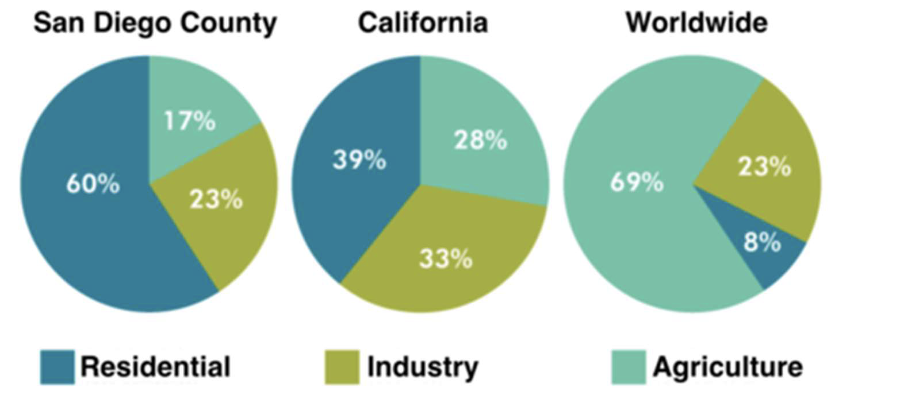

## 简单对比图
一般出现在混合图表中。混合图表里的两个图一般都是分开描述，如果有一些内在的联系，只需要在结尾段点出来就好了。

## 复杂对比图

### 文体结构

    1.Introduction：改写题目
    2.Overall：概括数据2-3个宏观规律
    3.数据分组介绍1
    4.数据分组介绍2

### For example

> **Task 1: The pie charts below compare water usage in San Diego, California and the rest of the world.**

*  ### Introduction：改写题目
    The pie charts give information about the water used for residential, industrial and agricultural purposes in San Diego County, California, and the world as a whole. 

*  ### Overall：数据的宏观规律：美国两个地区家庭用水量最大。相反，世界范围来看，农业用水占比最多。
    It is noticeable that more water is consumed by homes than by industry or agriculture in the two American regions. By contrast, agriculture accounts for the vast majority of water used worldwide. 

*  ### Body Paragraph 1 - 数据分组介绍1：San Diego, California地区用水类型跟全世界范围中差距较大的部分。
    In San Diego County and California State, residential water consumption accounts for 60% and 39% of total water usage. By contrast, a mere 8% of the water used globally goes to homes. The opposite trend can be seen when we look at water consumption for agriculture. This accounts for a massive 69% of global water use, but only 17% and 28% of water usage in San Diego and California respectively. 

*  ### Body Paragraph 2 - 数据分组介绍2：San Diego, California地区与全世界范围用水量差距不大的部分。
    Such dramatic differences are not seen when we compare the figures for industrial water use. The same proportion of water (23%) is used by industry in San Diego and worldwide, while the figure for California is 10% higher, at 33%. 