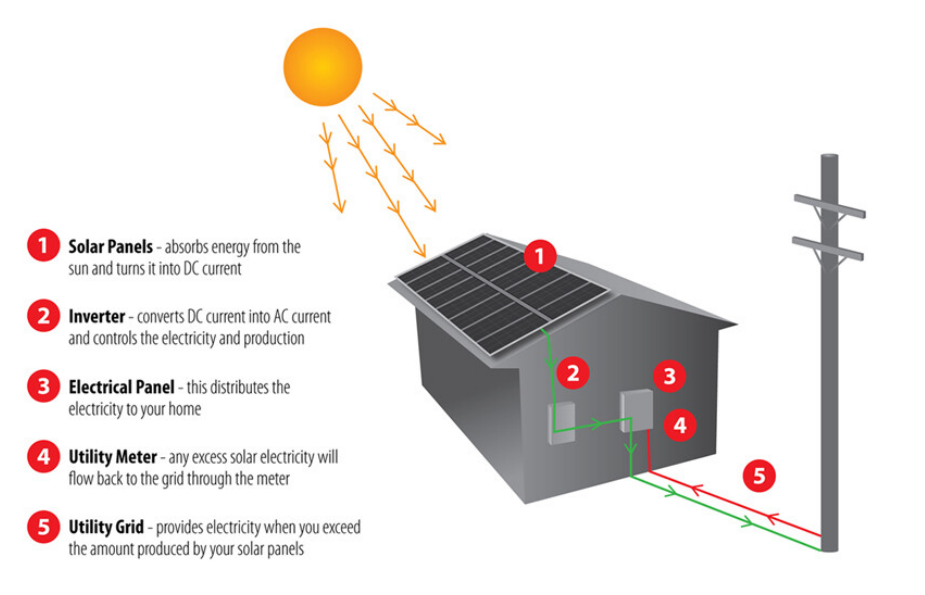

### 文体结构
    1. Introduction：改写题目
    2. Overall
    3. 核心段1: 具体描述1
    4. 核心段2: 具体描述2

### For example
> **Task 1: The diagram below shows how solar panels can be used to provide electricity for domestic use.**

*  ### Introduction：改写题目
    The picture illustrates the process of producing electricity in a home using solar panels. 

*  ### Overall：
    It is clear that there are five distinct stages in this process, beginning with the capture of energy from sunlight. The final two steps show how domestic electricity is connected to the external power supply. 

*  ### Body Paragraph 1 -
    At the first stage in the process, solar panels on the roof of a normal house take energy from the sun and convert it into DC current. Next, this current is passed to an inverter, which changes it to AC current and regulates the supply of electricity. At stage three, electricity is supplied to the home from an electrical panel. 

*  ### Body Paragraph 2 -
    At the fourth step shown on the diagram, a utility meter in the home is responsible for sending any extra electric power outside the house into the grid. Finally, if the solar panels do not provide enough energy for the household, electricity will flow from the utility grid into the home through the meter. 
