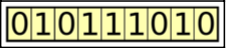

## 什么是遗传算法？

遗传算法是一个搜索算法系列，灵感来源于自然界的进化原理。通过模仿自然选择和繁殖的过程，遗传算法可以为涉及搜索、优化和学习的各种问题产生高质量的解决方案。同时，它们与自然进化的相似性使得遗传算法能够克服传统搜索和优化算法所遇到的一些障碍，特别是对于具有大量参数和复杂数学表示的问题。

### Darwinian evolution 达尔文进化理论

遗传算法实现了自然界中发生的达尔文进化论的简化版本。达尔文进化论的原则可以用以下原则来概括。

- 变异的原则: 属于一个种群的单个标本的特征（属性）可能有所不同。因此，这些标本在某种程度上彼此不同；例如，在其行为或外观上。

- 遗传的原则: 有些性状会从标本一直传给他们的后代。因此，后代与父母的相似程度高于与非亲属标本的相似程度。

- 选择的原则: 种群通常在其特定的环境中为资源而斗争。拥有更好地适应环境的特质的标本将更成功地生存下来，也将为下一代贡献更多的后代。

换句话说，进化维持着一个由个体标本组成的群体，这些个体标本相互之间存在差异。那些更好地适应其环境的人有更大的机会生存、繁殖，并将其特征传给下一代。这样一来，随着一代又一代的发展，物种变得更加适应它们的环境和面临的挑战。

进化的一个重要推动因素是 **交叉 crossover** 或 **重组 recombination** —— 在这种情况下，创造出的后代混合了其父母的性状。交叉有助于保持种群的多样性，并随着时间的推移将更好的性状聚集起来。此外，**突变 mutations** —— 性状的随机变化 —— 可以在进化中发挥作用，通过引入变化，每隔一段时间就会产生一个飞跃。

## The genetic algorithms analogy 遗传算法类比

遗传算法试图为一个给定的问题找到最佳解决方案。达尔文进化论保持了一个个体标本的群体，而遗传算法则保持了一个候选解决方案的群体，称为个体，用于解决该给定问题。这些候选解决方案被反复评估，并被用来创造新一代的解决方案。那些更善于解决这个问题的人有更大的机会被选中，并将他们的品质传递给下一代的候选解决方案。这样一来，随着一代又一代，候选解决方案在解决手头的问题方面越来越好。

后续，我们将描述遗传算法的各个组成部分，这些组成部分能够实现达尔文进化的这种类比。

## Genotype 基因型
在自然界中，育种、繁殖和变异是通过**基因型**来促进的 —— 一个被组合成染色体的基因集合。如果两个标本繁殖产生后代，后代的每条染色体将携带来自父母双方的混合基因。

模仿这个概念，在遗传算法的情况下，每个个体由代表基因集合的染色体来代表。例如，染色体可以表示为一个二进制字符串，其中每个比特代表一个基因。

前面的图片显示了一个这样的二进制编码染色体的例子，代表一个特定的个体。