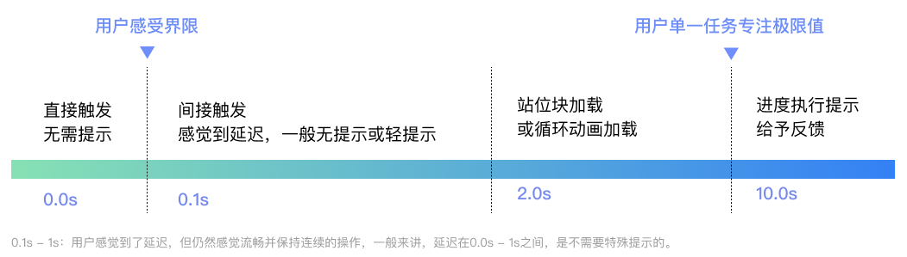
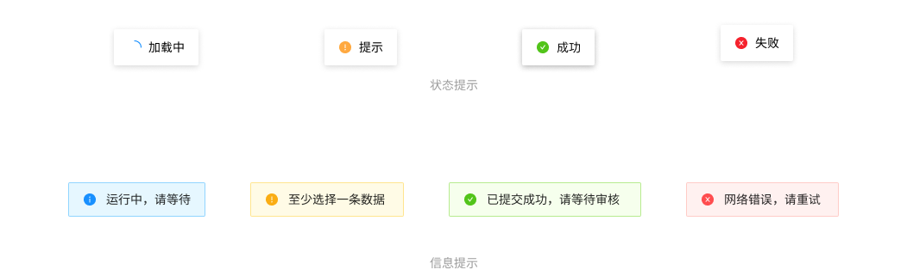

## 1. 系统状态可见原则 Visibility of system status
系统应当通过在`合理的时间`内提供`适当的反馈`，始终让用户了解正在发生的事情。

The system should always keep users informed about what is going on, through appropriate feedback within reasonable time. 

    保持界面的状态可见、变化可见、内容可见。让用户知道发生了什么，在适当的时间内作出适当的反馈。比如用户在网页上的任何操作，不论是单击、滚动还是按下键盘，页面应及时给出反馈。

### 1.1 合理的时间
0.1秒时用户瞬间感受的界限，这期间不需要任何提示，可直接显示结果。比如，当用户单击菜单在0.1s之内弹出，用户感觉是立即发生的；超过0.1s，就会有非即时的感觉。

#### 1.1.1 轻提示
1s - 2s：一般可以有一个轻提示，给用户操作及时反馈。
较轻量的信息提示或用户操作反馈，分为`状态提示`和`信息提示`两类，提示文字应精良精简，展示在页面顶部，会自动消失。

#### 1.1.2 加载
对于2s - 10s的操作，没有必要使用进度条，因为进度过快会显示会有闪烁，体验并不友好。这时可以使用站位块或加载动画，减少用户等待的焦虑感。

#### 1.1.3 进度条
10s是用户专注于单一任务的`极限`。对于超过10s延迟，在计算机执行的过程中应当给用户`加载提示`，并告知当前进度。

#### 1.1.4 超时、失败反馈
如果没有成功，应该给出失败的`反馈`，最好能给予`解决措施`，减少用户的记忆负担，B端的设计也可以加入品牌的元素，让页面更加风格化、品牌化。

### 1.2 适当的反馈
不同功能和场景下，应该给予不同的`反馈机制`，同时保证反馈的`及时性`，否则容易造成用户的困扰。

#### 1.2.1 位置反馈
B端设计的导航占有很大权重，这些导航都是为了用户时刻清楚自己坐在的系统位置，以及如何到达目的页面，方便进行后续操作。

1. 导航

各种导航让用户时刻了解自己所在的位置，在视觉上给予告知，方便用户随时操作前进或者后退。B端常见的导航包括但不限于：`竖向导航`（最常使用）、`横向导航`（一级内容过多时，不建议使用，需考虑到小屏幕自适应问题，小屏幕容易出现以及导航展示不全问题）、`组合导航`、`面包屑导航`等。

2. 位置反馈

用户操作后，应第一时间给予反馈，明确当前的操作状态。一般会分为：`默认状态`、`hover态`、`按下状态`、`不可用状态`。并不是每种状态在每一个部分都需要体现，需要设计师根据系统的设计进行理性判断。

3. 进度反馈

B端设计的进度反馈，一般反应步骤和当前位置。需要让用户了解`发生了什么`和`即将

## 2. 隐喻原则 Match between system and the real world
系统应该使用用户的语言，使用用户熟悉的单词、短语和概念，而不是面向系统的术语。遵循现实世界的惯例，使信息以自然和逻辑的顺序出现。

The system should speak the users' language, with words, phrases and concepts familiar to the user, rather than system-oriented terms. Follow real-world conventions, making information appear in a natural and logical order. 

## 3. 回退原则 User control and freedom
用户经常错误地选择系统功能，他们将需要一个明确标记的 "紧急出口 "来离开不需要的状态，而不需要通过一个扩展的对话。支持撤销和重做。

Users often choose system functions by mistake and will need a clearly marked "emergency exit" to leave the unwanted state without having to go through an extended dialogue. Support undo and redo. 

## 4. 一致原则 Consistency and standards
用户不应该怀疑不同的词语、情况或行动是否意味着同样的事情。遵循平台惯例。

Users should not have to wonder whether different words, situations, or actions mean the same thing. Follow platform conventions. 

## 5. 防错原则 Error prevention
比好的错误信息更好的是精心的设计，它可以从一开始就防止问题的发生。要么消除容易出错的条件，要么检查这些条件，并在用户承诺行动之前向他们提供一个确认选项。

Even better than good error messages is a careful design which prevents a problem from occurring in the first place. Either eliminate error-prone conditions or check for them and present users with a confirmation option before they commit to the action. 

## 6. 记忆原则 Recognition rather than recall
通过使对象、行动和选项可见，尽量减少用户的记忆负荷。用户不应该记住从对话的一个部分到另一个部分的信息。在适当的时候，系统的使用说明应该是可见的或容易检索的。

Minimize the user's memory load by making objects, actions, and options visible. The user should not have to remember information from one part of the dialogue to another. Instructions for use of the system should be visible or easily retrievable whenever appropriate. 

## 7. 灵活易用原则 Flexibility and efficiency of use
加速器--新手用户看不到--往往可以加快专家用户的互动，这样系统就可以同时满足没有经验和有经验的用户。允许用户定制频繁的操作。

Accelerators -- unseen by the novice user -- may often speed up the interaction for the expert user such that the system can cater to both inexperienced and experienced users. Allow users to tailor frequent actions. 

## 8. 简约设计原则 Aesthetic and minimalist design
对话不应包含不相关或很少需要的信息。对话中每一个额外的信息单元都会与相关的信息单元竞争，并降低它们的相对可见度。

Dialogues should not contain information which is irrelevant or rarely needed. Every extra unit of information in a dialogue competes with the relevant units of information and diminishes their relative visibility. 

## 9. 容错原则 Help users recognize, diagnose, and recover from errors
错误信息应该用简单的语言表达（没有代码），精确地指出问题，并建设性地提出解决方案。

Error messages should be expressed in plain language (no codes), precisely indicate the problem, and constructively suggest a solution. 

## 10. 帮助原则 Help and documentation
尽管如果系统不需要文件就能使用会更好，但可能还是有必要提供帮助和文件。任何这样的信息都应该易于搜索，集中在用户的任务上，列出要执行的具体步骤，而且不要太大。

Even though it is better if the system can be used without documentation, it may be necessary to provide help and documentation. Any such information should be easy to search, focused on the user's task, list concrete steps to be carried out, and not be too large.

