## 概览 Overview
According to the UK policy, people have to stay at home during pandemic times. So, In order to solve the self-isolating problems, EatUoY is a delivery app for University of York students and workers to order food from campus outlets, during COVID-19 period. Also, it can use in the future for a normal time. It allows students and workers to order or pre-order the food and drinks, also provide many suggestions with people to make a decision. It is designed to help users to have a nice delivery food experience in university. 

## 项目时间线 Project Timeline

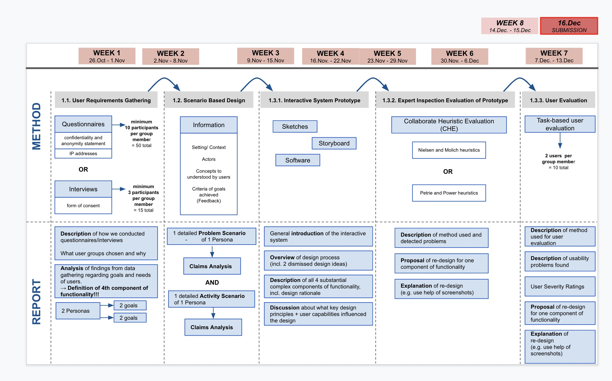

## 任务 Tasks
- 收集用户需求 User Requirements Gathering
    + 问卷设计 Qusetionnaire Design
    + 用户访问 User Interviews
    + 分析 Analysis

- 基于场景的设计 Scenario Based Design
    + 问题场景分析 Analysis of Problem Scenario
    + 活动场景 Activity Scenario
    + 其他分析 Other Analysis
    
- 交互系统原型和评估 Interactive System Prototype and Evaluation
    + 原形 Prototype
    + 重新设计的原型 Re-designed Prototype
    + 原型专家评估 Prototype Expert Evaluation

- 用户评价 User Evaluation

## 收集用户需求 User Requirements Gathering

## 头脑风暴 Brainstorming
> *   目标用户 Users
 	+ 学生 Students
 	+ 员工 Staff
    
> *   目的 Goals
  	+ 便宜 Cheap
  	+ 食品安全 Food safety
  	+ 快速 Fast
  	+ 货币转换 Money exchange
  	+ 折扣活动 Discount activities
  	+ 可送达每个校区 Delivery to every college
  	+ 提前预定食物 Preorder food
  	+ 咖啡时间 Coffee break
  	+ 庆祝活动 Celebration
  	+ 准时 On time
    
> *   设计 Design
  	+ 导航栏 Navigation bar
  	+ 搜索栏 Search bar
  	+ 食物图片 Food pictures
  	+ 共享地址 Share Location
  	+ 评论区 Reviews area
    
> *   安全 Safety
  	+ 新冠 COVID-19
  	+ 干净 Clean
  	+ 食物质量 Food quality
  	+ 健康 Health
  	+ 客户权利 Client right
    
> *   特性 Features
  	+ 咖啡、餐馆排名 Rate cafés and restaurants
  	+ 食物排名 Rate food
  	+ 野餐选项 Picinc option
  	+ 营业时间 Opening times
  	+ 不同支付选项 Different payment options
  	+ 配送时间 Delivery times
  	+ 评论 Reviews
    
    

## 问卷调查 Questionnaire
To develop a food delivery app for the University of York, we first conducted user research. Our approach was to design an online questionnaire using Qualtrics. The team prepared questions themed around demographics, behaviour, experience and satisfaction. Because they represent our target users, students and staff of the University of York were invited via email and social media to take part in this survey. Before accessing the questionnaire, they were asked to read a document containing information about the purpose of the study, their rights and data protection were then asked to give their consent. Finally, we collected 158 answers.

## 基于场景的设计 Scenario Based Design
### 设计定位 Design orientation
- When people decide to order food they would think about searching across a range pf catering outlets for different `food and drinks` before selecting and paying. They would make decision by `delivery speed` and `total prcie`.

- They want to `change location easily`. No matter when they are in which campus and choose different `outlets`.

- When people order food they would care about `food safety` and `food quality` so they want a platform to watch and share `reviews`.

- To obtain a good experience of delivery food they want to see `delivery man real location` and `communicate` on time

### 数据分析 Data Analysis
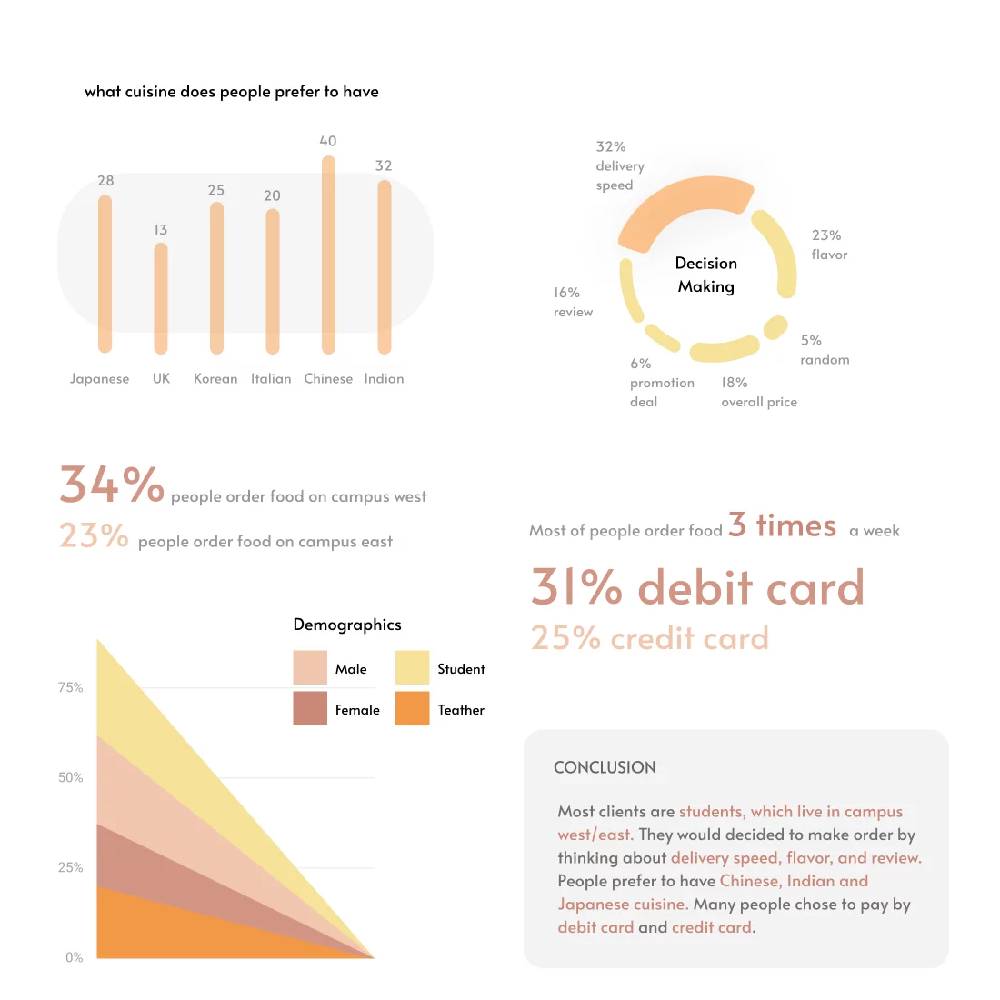

### 理解用户需求 Understanding User Needs
From the data analysis we identified three main user needs when it comes to food delivery apps. They are based around customer reviews, order tracking and price information. It is important that these needs are supported by user capabilities. These are the five senses: vision, hearing, taste, smell and touch, while memory and attention play a key factor as well. Each plays a part in perceiving the unique physical properties of the environment.

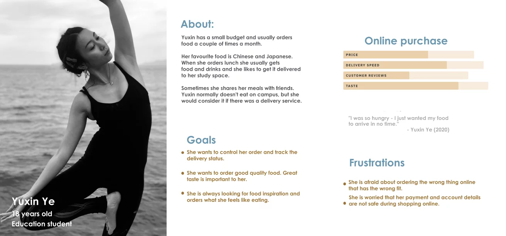
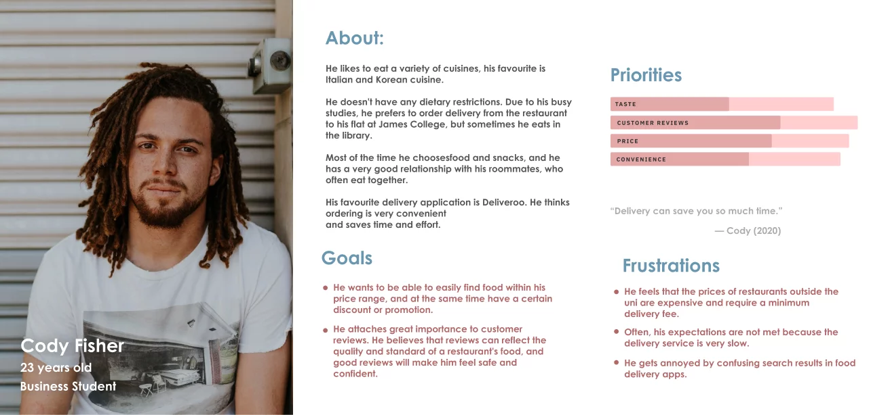
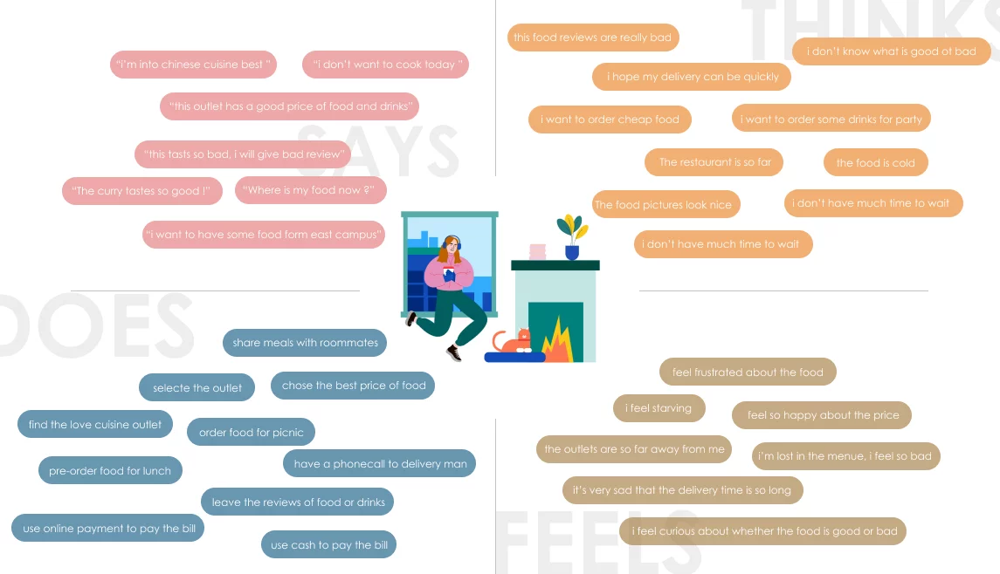

### 场景设想 Activity Scenario

Yuxin is a postgraduate education student of the University of York. She lives off campus and due to the ongoing Covid-19 pandemic she takes a mix ofonline and face-to-face classes. Today is one of the days she has to travel to the university, because she has two in-person seminars. Yuxin’s first seminar at Derwent College on Campus West just finished. She has just over one hour until her next seminar starts and for this gap she has booked herself a study space in the library to work on a project that is due soon. But it is also lunch time and Yuxin would like something to eat. She brought leftovers from last night with her but she feels like having aburger. The burgers at the Piazza restaurant on Campus East are supposed to be very good according to some fellow students. But that’s a 25 minute walk awayand by bus she won’t be much quicker. Yuxin won’t have enough time to work onher project in the library and to go get that burger before the next seminar. Luckily, Yuxin has EatUoY, the campus food delivery app, installed on her phone. On the app she quickly finds the Piazza restaurant, which has very positive overall reviews. Yuxin feels motivated and takes a look at the menu, where she can see ratings of the different items available. The teriyaki burger foronly £5 looks delicious and is rated 4.8 out of 5 stars. Yuxin decides that thisburger would make a perfect lunch together with a coke. The app allows her to pick her booked study space as the delivery location and with her university emailaddress she can log in, which saves her entering any more details. Yuxin paysby card and her order is placed successfully. The app lets Yuxin know her lunch will be at the chosen delivery location in 25 minutes. She feels relieved and is happy about the fast delivery. There is also a function for live delivery tracking, which she checks from time to time while working on her project in the library. Her lunch arrives right on time and Yuxin eats her burger. Her fellow students and the reviews were right: The teriyaki burger is very tasty. Yuxin is so happy with her lunch choice that she decides to give the burger a 5 star review in the app. She feels like she made a great lunch choice.

### Select food and choose a location

- Based on user research, we know that users have some trouble in choosing a good price and quality food. Therefore, we provide massive promotion deals and information on the homepage, people can find their goal directly and quickly.
    
- There's a pop-up label always show on the menu page, which helps users to know the product quantity clearly. After that, when they finish check products, they can choose their location using a map pin.
    
- One of the problems of our users' pain points are is that users desire to track the delivery details in time, so our solution is that users can check the delivery detail in real-time map, they can track delivery man's real-time location. They will know how long they will receive their food.

- Also, we provide delivery man information in the page, they can contact to delivery man directly. 

## 交互系统原型和评估 Interactive System Prototype and Evaluation
### 关键功能 Key Freatures
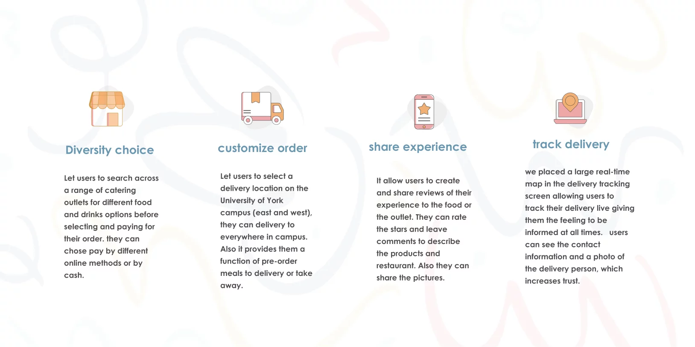

### 交互流程 UX Workflow
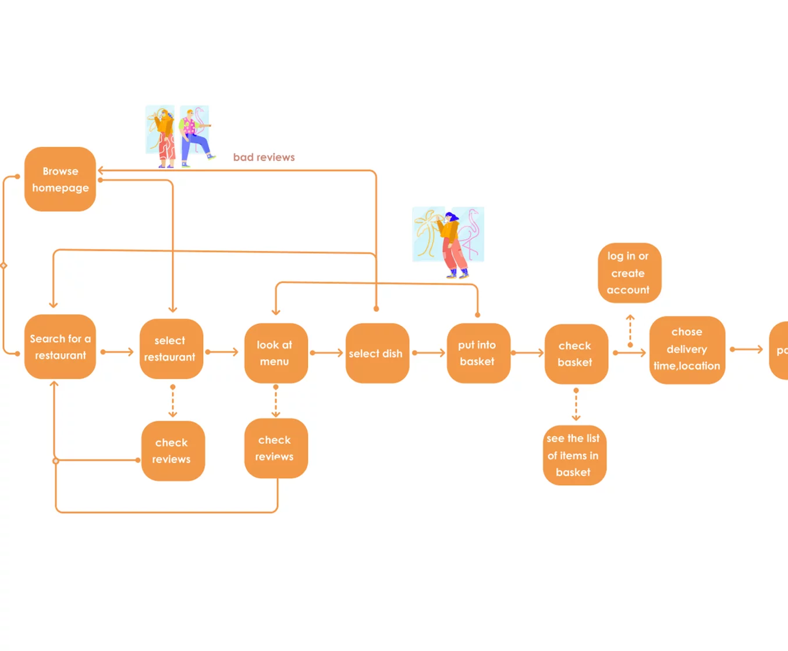

### ​线框图 Wireframes

### 原始草图 Original Drafts
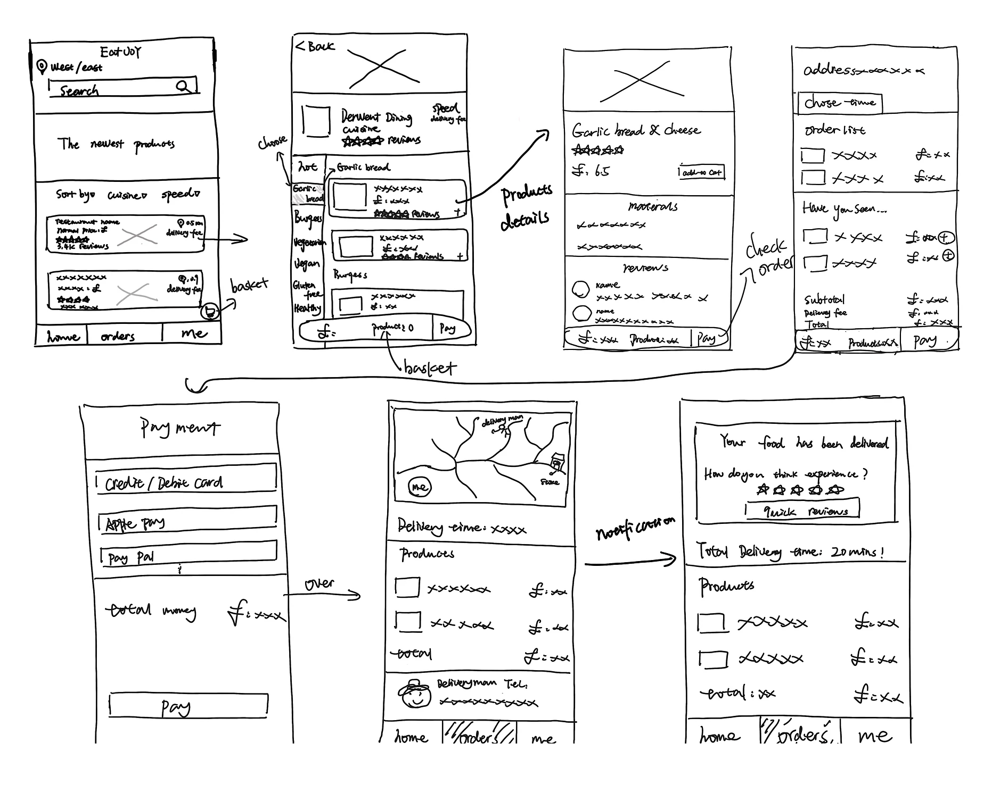

### 原形 Prototype
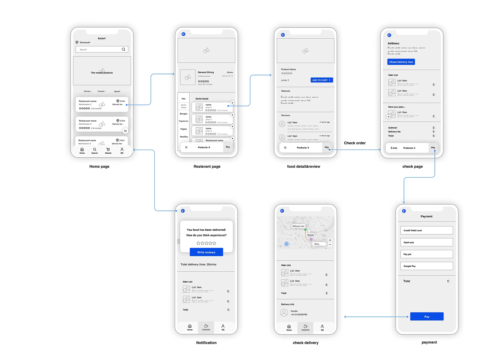    
    
## 原型的专家检查评估 Expert Inspection Evaluation of the Prototype

The Collaborative Heuristic Evaluation (CHE) of the food delivery app prototype was conducted by a team of 5 evaluators. One evaluator doubled as the driver and another evaluator as the notetaker. The session took place online using GoogleMeet.

The set of tasks were as follows: 
- Search for food types and/or restaurants.
- Select items from a menu.
- View/edit the basket.
- Place an order.
- Track the delivery.
- Give a review.

During the CHE the driver shared her screen with the other evaluators and clicked through the prototype upon request. On the problem recording sheet, the notetaker wrote down the problems found, their location within the prototype and the heuristics, which were violated. On the same sheet, the evaluators then secretly rated the severity of those problems on a scale from 1 (very minor) to 5 (very major). 0 was rated if it wasn’t regarded as a problem. The heuristics, which the evaluators referred to in the CHE, was the set of Petrie and Power Heuristics (appendix C). 

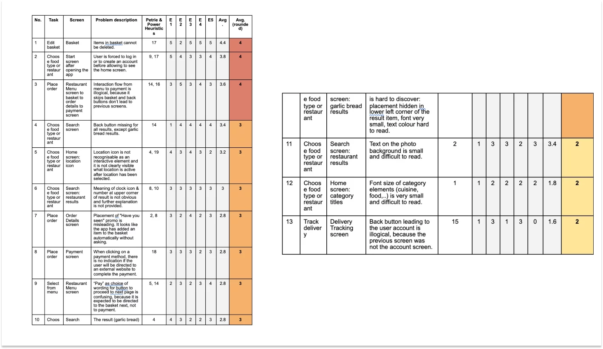

## 重新设计 Redesign
From the CHE, we see that the three most severe problems have an agreed rating of 4, which is the second-highest rating on the scale. Two of those problems (no. 1 and 3) are concerned with the first component of functionality. Based on the severity of the usability problems 1 and 3 as well as their importance of functionality, we have therefore chosen the first component for carrying out a redesign.

Problem no. 1 sits between selecting and paying aspects of the component. The detected problem describes the missing function of deleting an item from the basket. This violates heuristic 17 of Petrie & Power, because users will expect to be able to edit the basket by adding or deleting as many items as they like or changing their mind on items they have previously added. It may also happen that a user adds an item to the basket by mistake, so it has to be easy to recover from this mistake. The proposal for redesign in this case is to add a bin icon next to each item of the basket . The interaction will be improved by preventing users from making unconscious slips. By decreasing the quantity of a basket item to zero it will not automatically disappear from the basket, which may accidentally happen by tapping the minus too many times.

Problem no. 2 is concerned with the interaction flow from selecting to paying of the first component of functionality. Here we see heuristics 14 and 16 of Petrie & Power violated because the sequence of interaction is illogical and doesn’t follow established web conventions. The current process flow can be hardly confusing to the extent that it creates a gulf of execution when the user wants to view the basket but it is not clear how to get back to the basket from the order detail screen. Therefore, we suggest to improve the interaction flow between the restaurant menu screen and the payment screen. 

Based on CHE, we will replace the button currently labelled “pay” with a basket icon on the restaurant menu screen. To increase recognition it will be the same icon as used for the basket in the bottom menu bar. To go forward from the basket screen, the improved interaction flow will take the user to the order detail screen by tapping the “pay” button, from where they will be directed to the payment screen by tapping the “pay” button again. Through this redesign of the interaction flow, we can ensure a logical process following known web and logical conventions in the interaction which is expected by the user.

In order to improve the user's experience, we consider that when users chose the product they might regret it or by mistake, so it's quite easy to deal with a mistake on the same page. Through this redesign of the fault tolerance, we consider that this will be more user friendly easy to make an order.

## 用户评价 User Evaluation
In order to further improve the food delivery app, a remote usability testing was conducted with 10 participants using the prototype. The purpose of this user evaluation was to assess the usability of the app in terms of task flow, information architecture and interface design.

The participants were recruited by email and were sent an information sheet about the testing session, as well as a consent sheet, which they were asked to fill out and send back prior to the session.

The user evaluation took place online using GoogleMeet. The participants were sent a link to the prototyping software Figma in order to access the prototype.

During the user evaluation, an evaluator was present, as well as an observer. Each session was scheduled for 30 minutes.

At the beginning of each session the participant was briefed with an introductory explanation and expectation of the test. The evaluator then asked a few background questions about gender, age, occupation and prior experience with food delivery apps.

For the main test, the user was asked to share their screen and open the prototype on Figma. The user was presented with a scenario and a set of tasks to perform while thinking out loud. Afterwards, the participant answered questions about their overall satisfaction.

## 重新设计 Redesign
Addressing the first problem from user evaluation, the location icon will be removed from the home screen. The function behind this location icon is to show results based on availability on Campus West, East or both. But this could not be understood by half of the participants. To make it more clear, this type of filtering option will now be available on the search screen below the search bar.

The second problem is fairly easy to fix. We will add a banner to the food advertisement photo in order to make its meaning clear. By doing this, we incorporate the Gestalt principle of a focal point and breaking similarity intentionally to make it stand out visually so it will attract the viewer’s attention first.
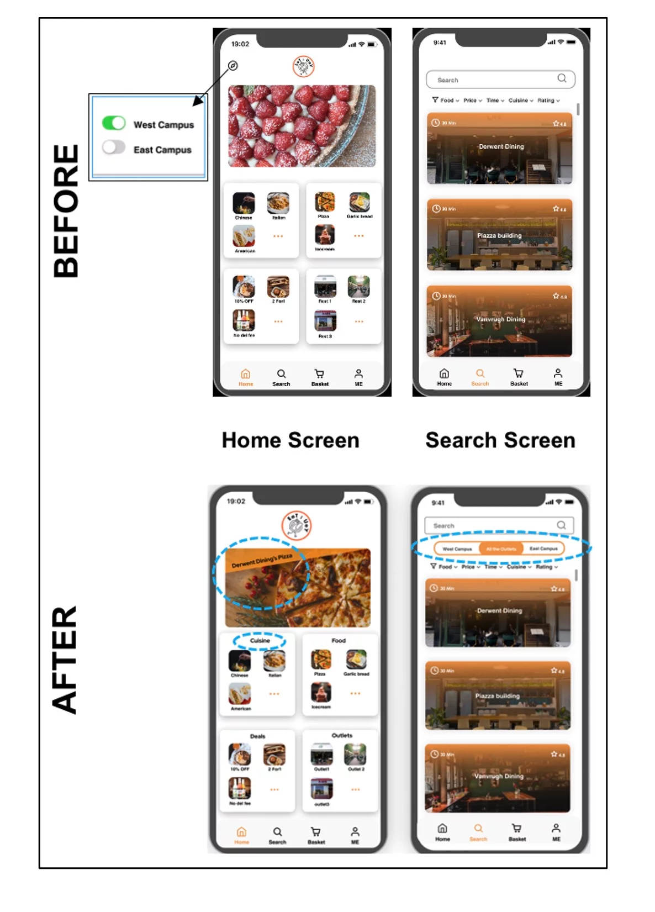