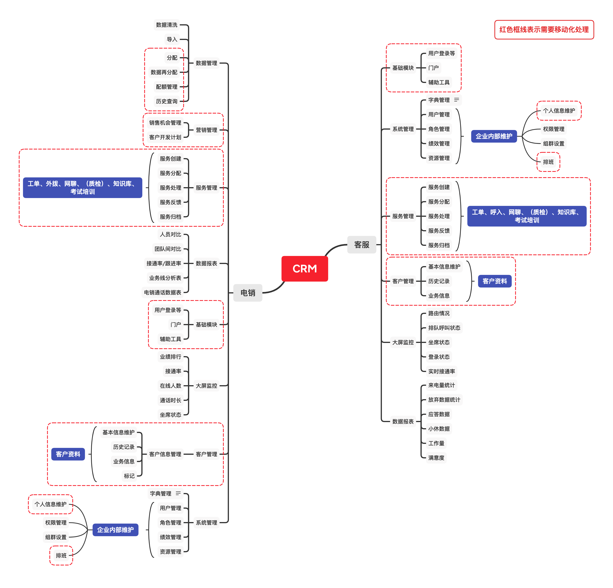
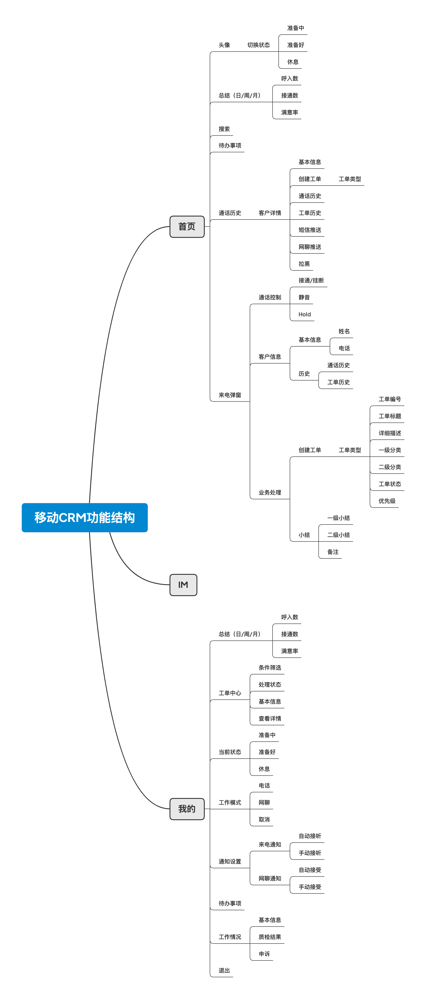
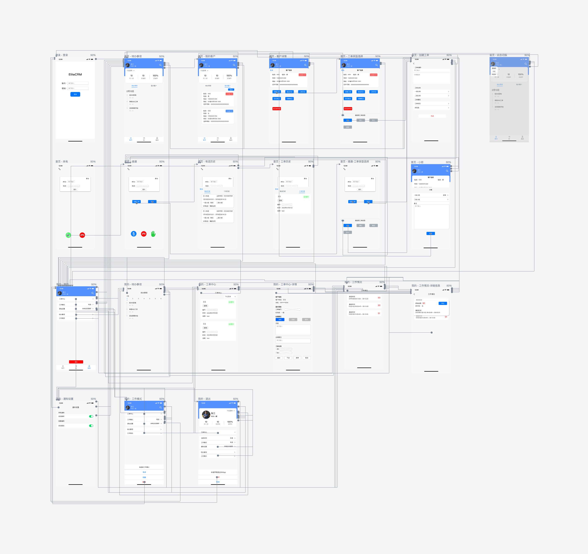

## 项目概述
目前因为疫情原因很多客户会提出移动客服，在手机上接电话，下工单，以及营销相关业务。现有web系统已经可以在手机App上进行工单处理、以及监控。

## 业务场景
- 在线客服
	- 本移动端的核心业务，包括有电话呼入呼出，网聊客服场景
- 客户管理
	- 客户信息管理，并提供如工单，短信推送等业务
- 工单处理
	- 支持创建工单，以及坐席权限范围内工单的持续跟进等
- 代办事项

- 排班管理

## web端功能分析

## 移动端功能结构

## 页面流程图

